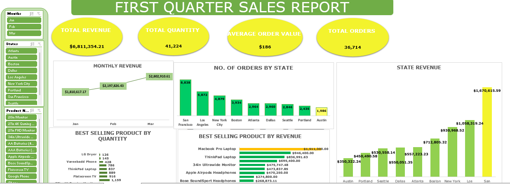

### First Quarter Sales Analysis

---
### **Table of Contents**
1. [Overview](#overview)  
2. [Problem Statement](#problem-statement)  
3. [Skills Demonstrated](#skills-demonstrated)  
4. [Data Source](#data-source)
5. [Tool](#tool)
6. [Findings](#findings)  
7. [Visualization](#visualization)  
8. [Recommendations](#recommendations)  

---
### **Overview**  
This analysis presents the sales performance for the first quarter, summarizing total revenue, total quantity sold, average order value, and total orders. It also provides insights into monthly revenue trends, state-wise orders and revenue, and best-selling products by quantity and revenue.  

---
### **Problem Statement**  
The objective is to identify key performance indicators (KPIs) that drive sales growth and to pinpoint areas for improvement to optimize sales strategies. Understanding the variation in revenue and sales trends across different states and products is critical for decision-making.   
I will be using the provided dataset to answer the following business questions;

1. Which Month has the highest revenue? 
2. Which product is the best selling in terms of quantity and
revenue? 
3. What is the AOV(average order value)? 
4. Which state did we get the most number of orders from? 
5.  Which state is generating the highest number of revenue?

---
### **Skills Demonstrated** 
- **Data Transformation:** Cleaning and Extracting information from different worksheet using Xlookup
- **Data Analysis:** Extracting and interpreting key sales metrics using pivot table
- **Data Visualization:** Designing clear and interactive visuals to present trends and insights.  
- **Dashboard Creation:** Developing a functional and user-friendly sales dashboard.  

---
### **Data Source**  
The data includes sales transactions for the first quarter, segmented by months, states, products, and revenue. It was source from [Sales_Data_Qtr_1](https://kaggle.com), a csv file with three worksheets containing detailed information.

 - Sales Data Qrt 1

 - Location

 - Products

---
### Tool
- Excel [Download here](https://microsoft.com)

---
### **Findings**

#### **1. Total Revenue:**  
A total revenue of **$6,811,354.21** was generated during the first quarter. It is a vital KPI that indicates the financial performance of the company during this period. The high revenue suggests strong sales performance across various products and regions. However, breaking down this revenue by state and product categories helps identify key contributors and areas for growth.

#### **2. Top-Performing Month: March **  
 The Month of **March** recorded the highest revenue of **$2,802,910.61** among the three months, showcasing a significant growth trend compared to January and February. This surge could be attributed to:  
- Seasonal factors such as promotional campaigns or holiday sales.  
- Increased demand for certain products, particularly high-ticket items like laptops and monitors.  

#### **3. State with Highest Revenue: San Francisco**  
**San Francisco** with **$1,670,615.59** is the leading state in terms of revenue contribution, generating nearly 25% of the total quarterly revenue. This dominance could result from:  
- A higher concentration of affluent customers.  
- Greater demand for premium products like MacBook Pro laptops and 34-inch ultrawide monitors.  

#### **4. Best-Selling Product (by Revenue): MacBook Pro Laptop**  
The MacBook Pro Laptop stands out as the highest-grossing product with **$1,511,300.00**, contributing over 22% of the total revenue. Its high unit price combined with substantial demand makes it a significant revenue driver.

#### **5. Best-Selling Product (by Quantity): LG Dryer**  
Although LG Dryers do not generate as much revenue as the MacBook Pro, they lead in terms of volume sold with **1,126 units**. This indicates:  
- Strong demand for affordable or practical home appliances.  
- Opportunities to maximize revenue by bundling dryers with complementary products or offering volume-based discounts.  

#### **6. Average Order Value (AOV): $186**  
The AOV represents the average revenue generated per order. This metric is critical for understanding customer purchasing behavior. At $186, it suggests:  
- Customers are purchasing a mix of high- and mid-range products.  
- Opportunities to increase AOV through upselling strategies, such as recommending accessories (e.g., headphones with laptops) or offering bundle deals.

#### **7. Monthly Revenue Trends**  
- **January:** $1,810,617.17 – The lowest performing month, likely reflecting slower post-holiday sales.  
- **February:** $2,197,826.43 – A moderate improvement, possibly due to mid-quarter promotions.  
- **March:** $2,802,910.61 – The best month, indicating a peak in sales activity.  
The upward trend demonstrates consistent growth, but understanding the underlying causes for this trend (e.g., marketing efforts or seasonal demand) will help sustain momentum.

#### **8. State Comparisons (Revenue & Orders)**  
- **Top States by Orders:**  
  - San Francisco (8,838 orders) and Los Angeles (5,872 orders) lead in both orders and revenue, indicating strong market penetration and customer loyalty.  
- **Underperforming States:**  
  - Austin (1,986 orders, $350,322.24 revenue) has the lowest performance. This might reflect smaller market size, insufficient marketing, or logistical challenges.  

#### **9. Product Insights**  
- **High-Revenue Products:**  
  - MacBook Pro Laptops and ThinkPad Laptops are premium products driving revenue.  
  - These items should be prioritized for stock replenishment and targeted promotions.  
- **Low-Performing Products:**  
  - Products with low revenue or sales volume should be re-evaluated. Identifying reasons for underperformance (e.g., pricing, market demand) can guide corrective actions.

---
### **Visualization**  
This project contains one report page that contains:
- **Revenue Trends:** A line chart depicting monthly revenue growth.  
- **State Comparisons:** Bar charts showing orders and revenue by state.  
- **Product Insights:** Horizontal bar charts highlighting top products by quantity and revenue.

---
### **Recommendations**

#### **1. Focus on High-Revenue States**
States like **San Francisco ($1,670,615.59) and Los Angeles ($1,058,319.24)** generate significant revenue and have a high volume of orders. These regions are strongholds that can be leveraged further.  
  - **Increase Marketing Investments:** Focus on targeted advertising in these regions, promoting both premium and mid-range products.  
  - **Exclusive Offers:** Introduce region-specific discounts or loyalty programs to retain existing customers and attract new ones.  
  - **Expand Distribution Channels:** Improve delivery speed and stock availability to maintain customer satisfaction.  

#### **2. Improve Underperforming States**
 States like **Austin (1,986 orders, $350,322.24) and Portland (2,435 orders, $530,558.14)** have low sales figures, indicating untapped potential or logistical challenges.  
  - **Conduct Market Research:** Understand customer preferences, demographics, and reasons for low demand.  
  - **Localized Campaigns:** Use targeted promotions and events tailored to these regions.  
  - **Optimize Logistics:** Evaluate supply chain issues, such as delayed deliveries or inadequate stock, which may deter repeat purchases.

#### **3. Maximize Revenue from Best-Selling Products**  
 The **MacBook Pro Laptop ($1,511,300.00) and LG Dryer (1,126 units)** are top sellers, indicating strong demand. Capitalizing on these products can boost overall revenue.  
  - **Stock Prioritization:** Ensure consistent stock levels for these items to avoid missed sales opportunities.  
  - **Cross-Selling Opportunities:** Bundle complementary products (e.g., headphones or software with laptops; detergents with dryers) to increase Average Order Value (AOV).  
  - **Highlight in Promotions:** Feature these products in marketing campaigns as "Best Sellers" to attract attention and increase sales volume.

#### **4. Address Low-Performing Products**  
Certain products show low sales volume or revenue, which may drain resources or occupy unnecessary inventory space.  
  - **Evaluate Product Viability:** Assess if these products align with customer needs or pricing expectations.  
  - **Discount Strategies:** Offer discounts or bundles to clear existing inventory and attract budget-conscious buyers.  
  - **Phase Out:** Consider discontinuing low-performing items and reallocating resources to better-selling products.

#### **5. Enhance Customer Experience to Boost Average Order Value (AOV)**  
The **AOV of $186** indicates a healthy mix of mid- and high-range purchases. Increasing this value can amplify overall revenue.  
  - **Personalized Recommendations:** Use data analytics to suggest complementary or upgraded products during checkout.  
  - **Bundle Deals:** Create curated product bundles at a slightly discounted price to encourage customers to purchase more.  
  - **Reward Programs:** Offer incentives, such as free shipping or loyalty points, for higher spending thresholds (e.g., orders above $200).

#### **6. Build on March’s Momentum**  
March **($2,802,910.61)** was the best-performing month, showing the highest revenue and sales activity.  
  - **Replicate Success:** Identify campaigns, seasonal factors, or product trends that contributed to March’s performance and apply them to other months.  
  - **Preemptive Promotions:** Roll out similar campaigns in January and February to combat slow starts in the quarter.  
  - **Stock Planning:** Ensure inventory levels for high-demand products are ready for anticipated peaks.

#### **7. Diversify Marketing Channels**  
 Leveraging multiple marketing platforms can improve brand visibility and engagement.  
  - **Digital Marketing:** Use social media, email campaigns, and paid ads to target different customer segments.  
  - **Influencer Partnerships:** Collaborate with influencers to promote best-selling products.  
  - **Content Marketing:** Share product reviews, testimonials, and case studies to build trust and attract more customers.

